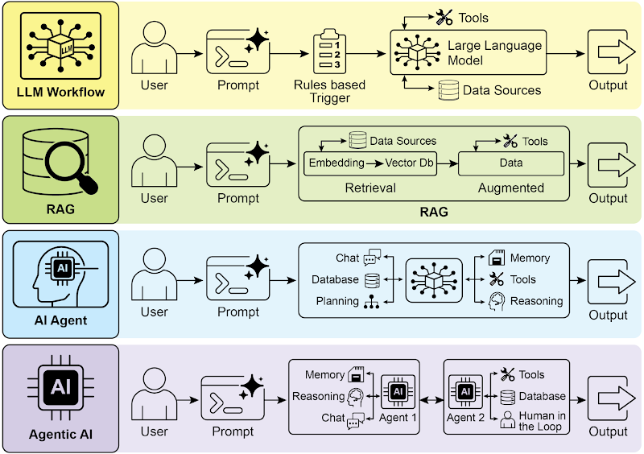
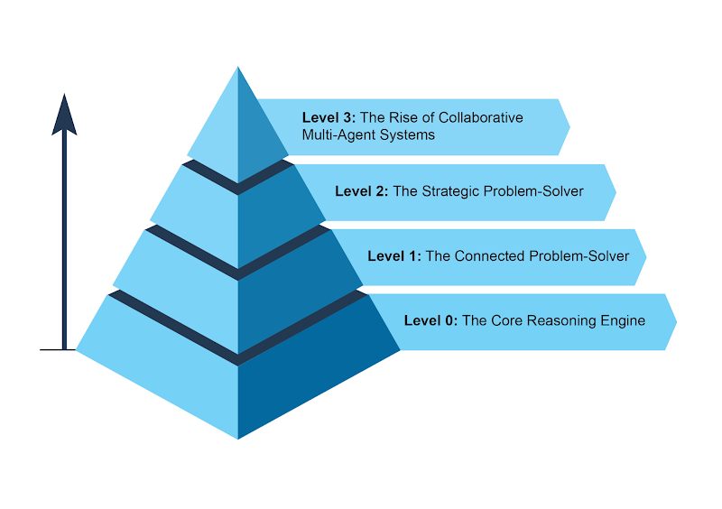

- 原文链接： https://docs.google.com/document/d/1Nw6hRa7ItdLr_Tj5hF2q-OH8B_uPKb--RLn8SXZKA94/edit?tab=t.0#heading=h.v967dsjfynku

What makes an AI system an Agent?
什么使得人工智能系统成为代理？

In simple terms, an AI agent is a system designed to perceive its environment and take actions to achieve a specific goal. It's an evolution from a standard Large Language Model (LLM), enhanced with the abilities to plan, use tools, and interact with its surroundings. Think of an Agentic AI as a smart assistant that learns on the job. It follows a simple, five-step loop to get things done (see Fig.1):
简单来说， AI 代理是一种旨在感知环境并采取行动实现特定目标的系统。它由标准的大型语言模型 (LLM) 演变而来，并增强了规划、使用工具以及与周围环境交互的能力。Agentic AI 可以理解为一个在工作中学习的智能助手 。它遵循一个简单的五步循环来完成任务（见图 1）：

1.  **Get the Mission**: You give it a goal, like "organize my schedule."
    **接受任务**：         你给它一个目标，比如“安排我的日程”。
2.  Scan the Scene: It gathers all the necessary information—reading emails, checking calendars, and accessing contacts—to understand what's happening.
    **扫描场景**：  它收集所有必要的信息（阅读电子邮件、检查日历和访问联系人）以了解正在发生的事情
3. **Think It Through**: It devises a plan of action by considering the optimal approach to achieve the goal.
   **仔细思考**：   它通过考虑实现目标的最佳方法来制定行动计划。
4. **Take Action**: It executes the plan by sending invitations, scheduling meetings, and updating your calendar.
   **采取行动**：   它通过发送邀请、安排会议和更新日历来执行计划。
5. **Learn and Get Better**: It observes successful outcomes and adapts accordingly. For example, if a meeting is rescheduled, the system learns from this event to enhance its future performance.
   **学习并进步**：           它观察成功的结果并做出相应的调整。                             例如，如果会议重新安排，系统将从此事件中吸取教训，以提高其未来的表现。

Fig.1: Agentic AI functions as an intelligent assistant, continuously learning through experience. It operates via a straightforward five-step loop to accomplish tasks.
图 1： Agentic AI 作为智能助手，通过经验不断学习。   它通过简单的五步循环来完成任务

Agents are becoming increasingly popular at a stunning pace. According to recent studies, a majority of large IT companies are actively using these agents, and a fifth of them just started within the past year. The financial markets are also taking notice. By the end of 2024, AI agent startups had raised more than $2 billion, and the market was valued at $5.2 billion. It's expected to explode to nearly $200 billion in value by 2034. In short, all signs point to AI agents playing a massive role in our future economy.
人工智能代理正以惊人的速度日益普及。根据最近的研究 ，大多数大型 IT 公司都在积极使用这些代理，其中五分之一的公司是在过去一年内才开始使用的。金融市场也对此密切关注。截至 2024 年底，人工智能代理初创公司已融资超过 20 亿美元，市场估值达到 52 亿美元。预计到 2034 年，其估值将激增至近 2000 亿美元。简而言之，所有迹象都表明，人工智能代理将在未来经济中发挥巨大作用。

In just two years, the AI paradigm has shifted dramatically, moving from simple automation to sophisticated, autonomous systems (see Fig. 2). Initially, workflows relied on basic prompts and triggers to process data with LLMs. This evolved with Retrieval-Augmented Generation (RAG), which enhanced reliability by grounding models on factual information. We then saw the development of individual AI Agents capable of using various tools.  Today, we are entering the era of Agentic AI, where a team of specialized agents works in concert to achieve complex goals, marking a significant leap in AI's collaborative power.
短短两年间，人工智能范式发生了翻天覆地的变化，从简单的自动化发展到复杂的自主系统（见图 2）。最初，工作流程依赖于基本的提示和触发器，通过 LLM 来处理数据。随着检索增强生成（RAG）技术的出现，这一模式得到了进一步发展，该技术通过将模型建立在事实信息之上，提高了模型的可靠性。随后，我们见证了能够使用各种工具的独立人工智能代理的发展。如今，我们正迈入“代理人工智能”（Agentic AI）时代，由专业代理组成的团队协同工作，共同实现复杂目标，这标志着人工智能协作能力的重大飞跃。

Fig 2.: Transitioning from LLMs to RAG, then to Agentic RAG, and finally to Agentic AI.
图 2： 从 LLM 过渡到 RAG，再过渡到 Agentic RAG，最后过渡到 Agentic AI。

The intent of this book is to discuss the design patterns of how  specialized agents can work in concert and collaborate to achieve  complex goals, and you will see one paradigm of collaboration and interaction in each chapter.
本书的目的是讨论专门的代理如何协同工作并合作实现复杂目标的设计模式，您将在每一章中看到一种协作和交互的范例。

Before doing that, let's examine examples that span the range of agent complexity (see Fig. 3).
在此之前，让我们先检查一下涵盖代理复杂性范围的示例（见图 3）。

### Level 0: The Core Reasoning Engine
0级：核心推理引擎

While an LLM is not an agent in itself, it can serve as the reasoning core of a basic agentic system. In a 'Level 0' configuration, the LLM operates without tools, memory, or environment interaction, responding solely based on its pretrained knowledge. Its strength lies in leveraging its extensive training data to explain established concepts. The trade-off for this powerful internal reasoning is a complete lack of current-event awareness. For instance, it would be unable to name the 2025 Oscar winner for "Best Picture" if that information is outside its pre-trained knowledge.
虽然 LLM 本身并非智能体，但它可以作为基本智能体的推理核心。在“0 级”配置下，LLM 无需工具、记忆或环境交互即可运行，仅基于其预训练知识进行响应 。 其优势在于利用丰富的训练数据来解释既定概念。这种强大的内部推理能力的代价是完全缺乏时事感知能力。例如，如果 2025 年奥斯卡“最佳影片”奖得主的信息超出了其预训练知识范围，它就无法说出该信息

### Level 1: The Connected Problem-Solver
第一级：互联问题解决者
At this level, the LLM becomes a functional agent by connecting to and utilizing external tools. Its problem-solving is no longer limited to its pre-trained knowledge. Instead, it can execute a sequence of actions to gather and process information from sources like the internet (via search) or databases (via Retrieval Augmented Generation, or RAG). For detailed information, refer to Chapter 14.
在这个层面上，LLM 通过连接和利用外部工具，成为了一个功能性代理。它的问题解决能力不再局限于预先训练的知识。相反，它可以执行一系列操作来收集和处理来自互联网（通过搜索）或数据库（通过检索增强生成，简称 RAG）等来源的信息。 有关详细信息，请参阅第 14 章。

For instance, to find new TV shows, the agent recognizes the need for current information, uses a search tool to find it, and then synthesizes the results. Crucially, it can also use specialized tools for higher accuracy, such as calling a financial API to get the live stock price for AAPL. This ability to interact with the outside world across multiple steps is the core capability of a Level 1 agent.
例如，为了查找新的电视节目，代理会识别当前信息的需求，使用搜索工具查找，然后综合结果。 至关重要的是，它还可以使用专门的工具来提高准确性，例如调用金融 API 获取 AAPL 的实时股价。这种跨步骤与外界交互的能力是 1 级代理的核心能力。

### Level 2: The Strategic Problem-Solver
第二级 ：战略性问题解决者

At this level, an agent's capabilities expand significantly, encompassing strategic planning, proactive assistance, and self-improvement, with prompt engineering and context engineering as core enabling skills.
在这个级别，代理的能力显著扩展，涵盖战略规划、主动协助和自我提升，其中快速工程和情境工程是核心支持技能。

First, the agent moves beyond single-tool use to tackle complex, multi-part problems through strategic problem-solving. As it executes a sequence of actions, it actively performs context engineering: the strategic process of selecting, packaging, and managing the most relevant information for each step. For example, to find a coffee shop between two locations, it first uses a mapping tool. It then engineers this output, curating a short, focused context—perhaps just a list of street names—to feed into a local search tool, preventing cognitive overload and ensuring the second step is efficient and accurate. To achieve maximum accuracy from an AI, it must be given a short, focused, and powerful context. Context engineering is the discipline that accomplishes this by strategically selecting, packaging, and managing the most critical information from all available sources. It effectively curates the model's limited attention to prevent overload and ensure high-quality, efficient performance on any given task. For detailed information, refer to the Appendix A.
首先，智能体不再局限于单一工具的使用，而是通过策略性的问题解决来应对复杂的、多部分的问题。在执行一系列操作时，它会主动执行情境工程： 即为每个步骤选择、打包和管理最相关信息的策略性过程。例如，要在两个地点之间找到一家咖啡店，它首先会使用地图工具。然后，它会对输出进行设计，整理一个简短、重点突出的情境（可能只是一串街道名称）并将其输入到本地搜索工具中，从而防止认知过载，并确保第二步高效准确。为了使人工智能获得最高的准确率，必须为其提供简短、重点突出且强大的情境。 情境工程是通过从所有可用来源中策略性地选择、打包和管理最关键信息来实现这一目标的一门学科。它有效地管理模型有限的注意力，以防止过载，并确保在任何给定任务上都能高质量、高效地执行 。 有关详细信息，请参阅附录 A。

This level leads to proactive and continuous operation. A travel assistant linked to your email demonstrates this by engineering the context from a verbose flight confirmation email; it selects only the key details (flight numbers, dates, locations) to package for subsequent tool calls to your calendar and a weather API.
这一层级实现了主动且持续的运营。一个链接到你邮箱的旅行助手就体现了这一点，它从一封冗长的航班确认邮件中提取上下文信息；它只选择关键细节（航班号、日期、地点）打包，以便后续工具调用你的日历和天气 API。

In specialized fields like software engineering, the agent manages an entire workflow by applying this discipline. When assigned a bug report, it reads the report and accesses the codebase, then strategically engineers these large sources of information into a potent, focused context that allows it to efficiently write, test, and submit the correct code patch.
在软件工程等专业领域，代理会运用这门学科来管理整个工作流程。当收到错误报告时，它会读取报告并访问代码库，然后策略性地将这些海量信息源整合到一个强大而集中的环境中，以便高效地编写、测试并提交正确的代码补丁。

Finally, the agent achieves self-improvement by refining its own context engineering processes. When it asks for feedback on how a prompt could have been improved, it is learning how to better curate its initial inputs. This allows it to automatically improve how it packages information for future tasks, creating a powerful, automated feedback loop that increases its accuracy and efficiency over time. For detailed information, refer to Chapter 17.
最后，智能体通过完善自身的情境工程流程实现自我提升。当它寻求关于如何改进提示的反馈时，它正在学习如何更好地管理其初始输入。这使得它能够自​​动改进为未来任务打包信息的方式 ，从而创建一个强大的自动化反馈循环，随着时间的推移提高其准确性和效率。 有关详细信息，请参阅第 17 章。

### 

Fig. 3: Various instances demonstrating the spectrum of agent complexity.
图 3： 展示代理复杂性范围的各种实例。

### Level 3: The Rise of Collaborative Multi-Agent Systems
第三级：协作多智能体系统的兴起

At Level 3, we see a significant paradigm shift in AI development, moving away from the pursuit of a single, all-powerful super-agent and towards the rise of sophisticated, collaborative multi-agent systems. In essence, this approach recognizes that complex challenges are often best solved not by a single generalist, but by a team of specialists working in concert. This model directly mirrors the structure of a human organization, where different departments are assigned specific roles and collaborate to tackle multi-faceted objectives. The collective strength of such a system lies in this division of labor and the synergy created through coordinated effort. For detailed information, refer to Chapter 7.
在第三级，我们看到人工智能发展发生了重大的范式转变，不再追求单一、全能的超级智能体，而是走向复杂、协作的多智能体系统。本质上，这种方法认识到，解决复杂挑战的最佳方案往往不是依靠单个通才，而是由一个专家团队协同工作 。这种模式直接反映了人类组织的结构，不同部门被赋予特定的角色，并相互协作以应对多方面的目标。这种系统的集体力量在于这种分工以及通过协调努力产生的协同效应。 有关详细信息，请参阅第七章。

To bring this concept to life, consider the intricate workflow of launching a new product. Rather than one agent attempting to handle every aspect, a "Project Manager" agent could serve as the central coordinator. This manager would orchestrate the entire process by delegating tasks to other specialized agents: a "Market Research" agent to gather consumer data, a "Product Design" agent to develop concepts, and a "Marketing" agent to craft promotional materials. The key to their success would be the seamless communication and information sharing between them, ensuring all individual efforts align to achieve the collective goal.
为了将这一概念付诸实践，不妨想象一下新产品发布的复杂工作流程。与其让一位代理人试图处理所有环节，不如让一位“项目经理”代理人充当中央协调者。这位经理会将任务委派给其他专门的代理人，从而协调整个流程：“市场调研”代理人负责收集消费者数据，“产品设计”代理人负责开发概念，“市场营销”代理人负责制作宣传材料。他们成功的关键在于彼此之间无缝沟通和信息共享，确保所有个人努力协调一致，共同实现目标。

While this vision of autonomous, team-based automation is already being developed, it's important to acknowledge the current hurdles. The effectiveness of  such multi-agent systems is presently constrained by the reasoning limitations of LLMs they are using. Furthermore, their ability to genuinely learn from one another and improve as a cohesive unit is still in its early stages. Overcoming these technological bottlenecks is the critical next step, and doing so will unlock the profound promise of this level: the ability to automate entire business workflows from start to finish.
虽然这种自主的、基于团队的自动化愿景已在发展中，但必须认识到目前存在的障碍。 此类多智能体系统的有效性目前受到其所用法学硕士（LLM）推理能力的限制。此外，它们真正相互学习并作为一个有凝聚力的单元不断改进的能力仍处于早期阶段。克服这些技术瓶颈是下一步的关键，而这样做将释放这一层级的巨大潜力：从头到尾实现整个业务工作流程的自动化。

### The Future of Agents: Top 5 Hypotheses
代理人的未来：五大假设

AI agent development is progressing at an unprecedented pace across domains such as software automation, scientific research, and customer service among others. While current systems are impressive, they are just the beginning. The next wave of innovation will likely focus on making agents more reliable, collaborative, and deeply integrated into our lives. Here are five leading hypotheses for what's next (see Fig. 4).
人工智能代理的开发正以前所未有的速度在软件自动化、科学研究和客户服务等领域取得进展。 尽管目前的系统令人印象深刻，但这仅仅是个开始。下一波创新浪潮可能会聚焦于让代理更加可靠、更具协作性，并深度融入我们的生活。以下是未来发展的五个主要假设（见图 4）。

### Hypothesis 1: The Emergence of the Generalist Agent
假设1：多面手智能体的出现

The first hypothesis is that AI agents will evolve from narrow specialists into true generalists capable of managing complex, ambiguous, and long-term goals with high reliability. For instance, you could give an agent a simple prompt like, "Plan my company's offsite retreat for 30 people in Lisbon next quarter." The agent would then manage the entire project for weeks, handling everything from budget approvals and flight negotiations to venue selection and creating a detailed itinerary from employee feedback, all while providing regular updates. Achieving this level of autonomy will require fundamental breakthroughs in AI reasoning, memory, and near-perfect reliability. An alternative, yet not mutually exclusive, approach is the rise of Small Language Models (SLMs). This "Lego-like" concept involves composing systems from small, specialized expert agents rather than scaling up a single monolithic model. This method promises systems that are cheaper, faster to debug, and easier to deploy. Ultimately, the development of large generalist models and the composition of smaller specialized ones are both plausible paths forward, and they could even complement each other.
第一个假设是，AI 代理将从单一领域的专家进化为真正的通才，能够高度可靠地管理复杂、模糊且长期的目标。例如，你可以给代理一个简单的提示，例如“计划我公司下季度在里斯本举办的 30 人异地务虚会”。然后，代理将负责管理整个项目数周，处理从预算审批、航班谈判到场地选择的所有事务，并根据员工反馈制定详细的行程，同时定期提供更新。 要实现这种程度的自主性，需要在 AI 推理、记忆和近乎完美的可靠性方面取得根本性的突破。另一种并非相互排斥的方法是小型语言模型 ( SLM ) 的兴起。这种“类似乐高”的概念涉及由小型、专门的专家代理组成系统，而不是扩展单个整体模型。这种方法有望使系统更便宜、调试更快、部署更轻松。最终，大型通用模型的开发和较小专业模型的组成都是可行的前进道路，甚至可以相互补充。

### Hypothesis 2: Deep Personalization and Proactive Goal Discovery
假设2：深度个性化和主动目标发现

The second hypothesis posits that agents will become deeply personalised and proactive partners. We are witnessing the emergence of a new class of agent: the proactive partner. By learning from your unique patterns and goals, these systems are beginning to shift from just following orders to anticipating your needs. AI systems operate as agents when they move beyond simply responding to chats or instructions. They initiate and execute tasks on behalf of the user, actively collaborating in the process.  This moves beyond simple task execution into the realm of proactive goal discovery.
第二个假设认为，代理将成为高度个性化且积极主动的合作伙伴。我们正在见证一种新型代理的出现：积极主动的合作伙伴。 通过学习您独特的模式和目标，这些系统开始从仅仅遵循命令转变为预测您的需求。 当人工智能系统不再仅仅响应聊天或指令时，它们就充当了代理的角色。   它们代表用户发起并执行任务，并在此过程中积极协作。 这超越了简单的任务执行，进入了主动目标发现的领域。

For instance, if you're exploring sustainable energy, the agent might identify your latent goal and proactively support it by suggesting courses or summarizing research. While these systems are still developing, their trajectory is clear. They will become increasingly proactive, learning to take initiative on your behalf when highly confident that the action will be helpful. Ultimately, the agent becomes an indispensable ally, helping you discover and achieve ambitions you have yet to fully articulate.
例如，如果您正在探索可持续能源，代理可能会识别您的潜在目标，并通过推荐课程或总结研究成果来主动支持您。虽然这些系统仍在发展中，但它们的发展轨迹已经清晰。它们会变得越来越主动，在高度确信行动有益时，学会主动为您采取行动。最终，代理会成为您不可或缺的盟友，帮助您发现并实现尚未完全表达的抱负。

Fig. 4: Five hypotheses about the future of agents
图 4： 关于代理人未来的五种假设

### Hypothesis 3: Embodiment and Physical World Interaction
假设 3： 具身化与物理世界互动
This hypothesis foresees agents breaking free from their purely digital confines to operate in the physical world. By integrating agentic AI with robotics, we will see the rise of "embodied agents." Instead of just booking a handyman, you might ask your home agent to fix a leaky tap. The agent would use its vision sensors to perceive the problem, access a library of plumbing knowledge to formulate a plan, and then control its robotic manipulators with precision to perform the repair. This would represent a monumental step, bridging the gap between digital intelligence and physical action, and transforming everything from manufacturing and logistics to elder care and home maintenance.
这一假设预示着智能体将摆脱纯粹的数字束缚，在物理世界中运作。通过将智能体人工智能与机器人技术相结合，我们将见证“ 具身智能体 ”的崛起。与其简单地预约一名勤杂工，不如让你的家居智能体来修理漏水的水龙头。智能体将利用其视觉传感器感知问题，访问管道知识库来制定计划，然后精确控制其机器人机械手执行维修。这将是意义非凡的一步，它将弥合数字智能与物理行为之间的差距，并彻底改变从制造、物流到老年护理和家庭维护等各个领域。

### Hypothesis 4: The Agent-Driven Economy
假设 4：代理驱动型经济  
The fourth hypothesis is that highly autonomous agents will become active participants in the economy, creating new markets and business models. We could see agents acting as independent economic entities, tasked with maximising a specific outcome, such as profit. An entrepreneur could launch an agent to run an entire e-commerce business. The agent would identify trending products by analysing social media, generate marketing copy and visuals, manage supply chain logistics by interacting with other automated systems, and dynamically adjust pricing based on real-time demand. This shift would create a new, hyper-efficient "agent economy" operating at a speed and scale impossible for humans to manage directly.
第四个假设是，高度自主的智能体将成为经济的积极参与者，创造新的市场和商业模式。 我们可以看到智能体作为独立的经济实体，肩负着最大化特定结果（例如利润）的任务。企业家可以启动一个智能体来运营整个电商业务。该智能体将通过分析社交媒体识别热门产品，生成营销文案和视觉效果，通过与其他自动化系统交互来管理供应链物流，并根据实时需求动态调整价格。这种转变将创造一个全新的、超高效的“智能体经济”，其运行速度和规模是人类无法直接管理的。

### Hypothesis 5:  The Goal-Driven, Metamorphic Multi-Agent System
假设 5： 目标驱动的变形多智能体系统
This hypothesis posits the emergence of intelligent systems that operate not from explicit programming, but from a declared goal. The user simply states the desired outcome, and the system autonomously figures out how to achieve it. This marks a fundamental shift towards metamorphic multi-agent systems capable of true self-improvement at both the individual and collective levels.
这一假设预示着智能系统的出现，其运行并非基于明确的编程，而是基于既定的目标。用户只需陈述期望的结果，系统就会自主地找出实现目标的方法。这标志着向变形多智能体系统的根本性转变，该系统能够在个体和集体层面实现真正的自我完善。

This system would be a dynamic entity, not a single agent. It would have the ability to analyze its own performance and modify the topology of its multi-agent workforce, creating, duplicating, or removing agents as needed to form the most effective team for the task at hand. This evolution happens at multiple levels:
该系统将是一个动态实体，而非单一智能体。它将能够分析自身的绩效，并调整其多智能体团队的拓扑结构，根据需要创建、复制或移除智能体，从而组建最高效的团队来完成当前任务。这种演变发生在多个层面：

Architectural Modification: At the deepest level, individual agents can rewrite their own source code and re-architect their internal structures for higher efficiency, as in the original hypothesis.
架构修改：在最深层次上，单个代理可以重写自己的源代码并重新构建其内部结构以提高效率，就像最初的假设一样。
Instructional Modification: At a higher level, the system continuously performs automatic prompt engineering and context engineering. It refines the instructions and information given to each agent, ensuring they are operating with optimal guidance without any human intervention.
指令修改：在更高层面上，系统持续执行自动提示工程和上下文工程。它不断完善给予每个代理的指令和信息，确保它们在无需人工干预的情况下以最佳指导运行。
For instance, an entrepreneur would simply declare the intent: "Launch a successful e-commerce business selling artisanal coffee." The system, without further programming, would spring into action. It might initially spawn a "Market Research" agent and a "Branding" agent. Based on the initial findings, it could decide to remove the branding agent and spawn three new specialized agents: a "Logo Design" agent, a "Webstore Platform" agent, and a "Supply Chain" agent. It would constantly tune their internal prompts for better performance. If the webstore agent becomes a bottleneck, the system might duplicate it into three parallel agents to work on different parts of the site, effectively re-architecting its own structure on the fly to best achieve the declared goal.
例如，一位创业者只需简单声明其意图：“推出一家销售手工咖啡的成功电商企业。” 系统无需进一步编程，即可立即行动。它最初可能会生成一个“市场调研”代理和一个“品牌推广”代理。根据初步调查结果，系统可能会决定移除品牌推广代理，并生成三个新的专业代理：“徽标设计”代理、“网店平台”代理和“供应链”代理。系统会不断调整其内部提示，以提高性能。如果网店代理成为瓶颈，系统可能会将其复制成三个并行代理，分别负责网站的不同部分，从而有效地动态重构自身架构，以最佳地实现既定目标。

## Conclusion  结论

1.  Cloudera, Inc. (April 2025), 96% of enterprises are increasing their use of AI agents.[https://www.cloudera.com/about/news-and-blogs/press-releases/2025-04-16-96-percent-of-enterprises-are-expanding-use-of-ai-agents-according-to-latest-data-from-cloudera.html](https://www.google.com/url?q=https://www.cloudera.com/about/news-and-blogs/press-releases/2025-04-16-96-percent-of-enterprises-are-expanding-use-of-ai-agents-according-to-latest-data-from-cloudera.html&sa=D&source=editors&ust=1760628090407350&usg=AOvVaw36qly0m48iGnGMMhX0LzNz) 
2.  Autonomous generative AI agents: [https://www.deloitte.com/us/en/insights/industry/technology/technology-media-and-telecom-predictions/2025/autonomous-generative-ai-agents-still-under-development.html](https://www.google.com/url?q=https://www.deloitte.com/us/en/insights/industry/technology/technology-media-and-telecom-predictions/2025/autonomous-generative-ai-agents-still-under-development.html&sa=D&source=editors&ust=1760628090407831&usg=AOvVaw3RaQMGuPxxlOcI9_b7WE-H) 
3.  Market.us. Global Agentic AI Market Size, Trends and Forecast 2025–2034. [https://market.us/report/agentic-ai-market/](https://www.google.com/url?q=https://market.us/report/agentic-ai-market/&sa=D&source=editors&ust=1760628090408168&usg=AOvVaw25FtgXCAyjsHCltE7GuZIU)

